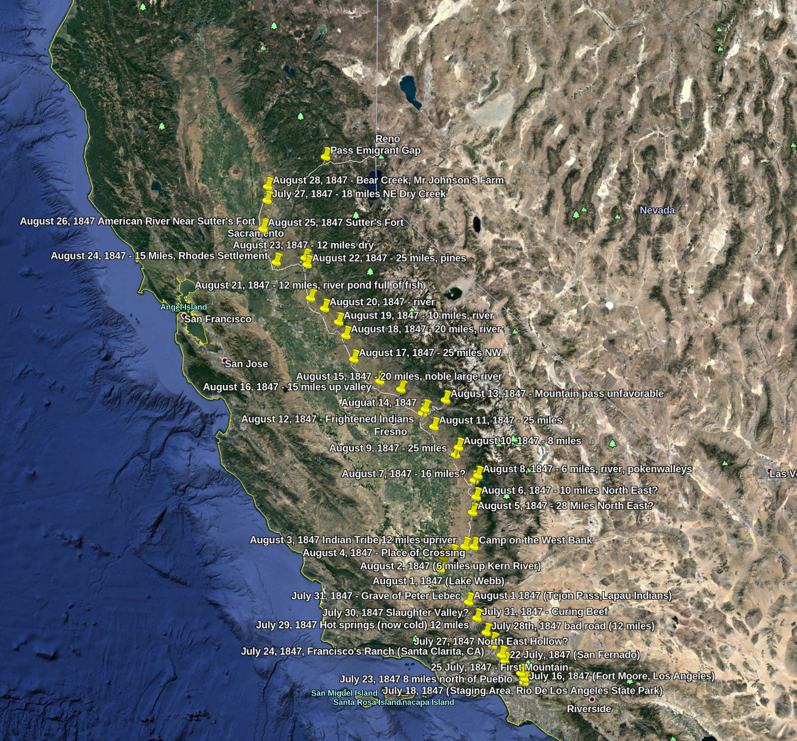

# Pace-Hancock-Petigrew-Company1847
A large group of Mormon Battalion veterans traveled along the western foothills of the Sierra Nevada mountains of Alta California, after their discharge from
the Army of the west after the end of the war with Mexico, 1847.  Their trail diaries record some amazing experiences, as well as names of many
native american tribes, bands, and individuals, most of whom are lost to recorded history due to disasterous events that followed during the gold rush. This
project is an attempt to collaborate using the technology that is now available, to stitch some of that history back together.

This KMZ file can be opened as a map in Google Earth.  It shows best-guess locations of camp sites and trail based (so far) on the diaries of James Pace,
Robert Stanton Bliss, and Levi Hancock. KMZ files are actually Zip compressed files.  If you rename it to a .zip, you can extract doc.kml, which is the actual content Google Earth reads.  I've also attached the KML file.

How you can help:  

This needs more fidelity and content! Fork my repository, make your changes, and make a pull request so I can update my own repository. If you have
new info from journals I don't have yet, add them!  If you think the location is a little off, change it, and make a pull request!  Github lets us keep track of 
changes and adjust if something doesn't look quite right.  Together we can set the record strait, honor those who once lived, and tell their un-told story.

Star and Watch if interested in this project!  I appreciate communication too, don't hesitate to drop me a note.

